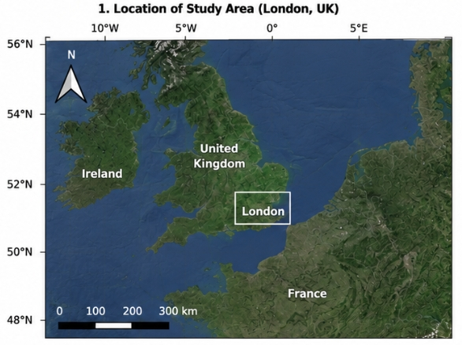
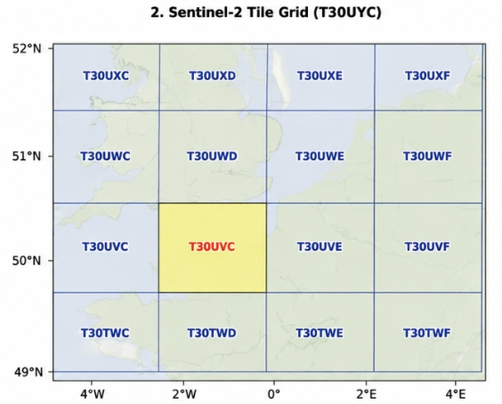
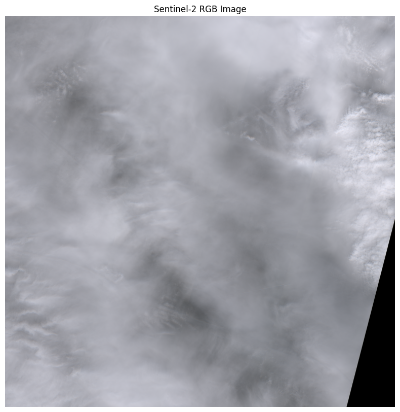
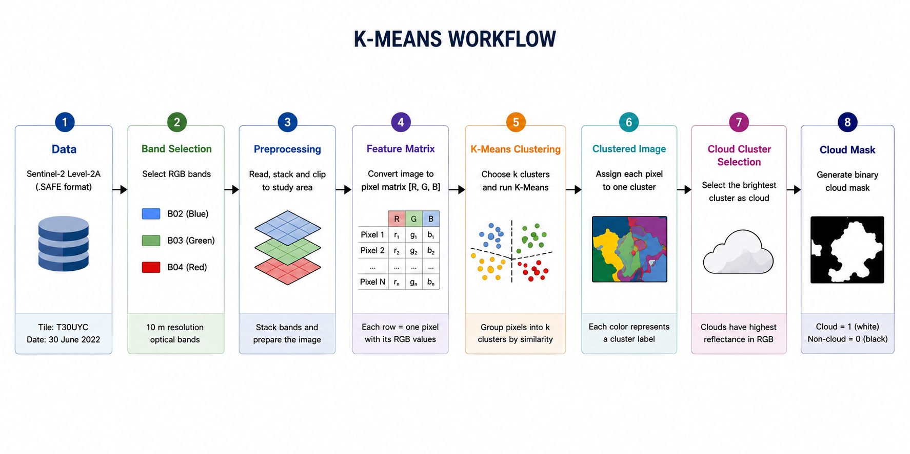
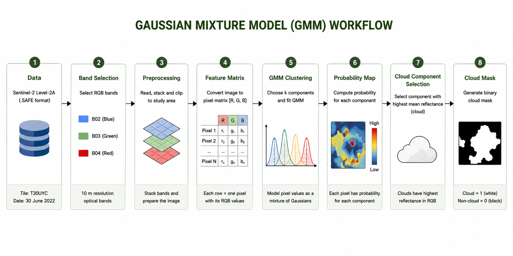
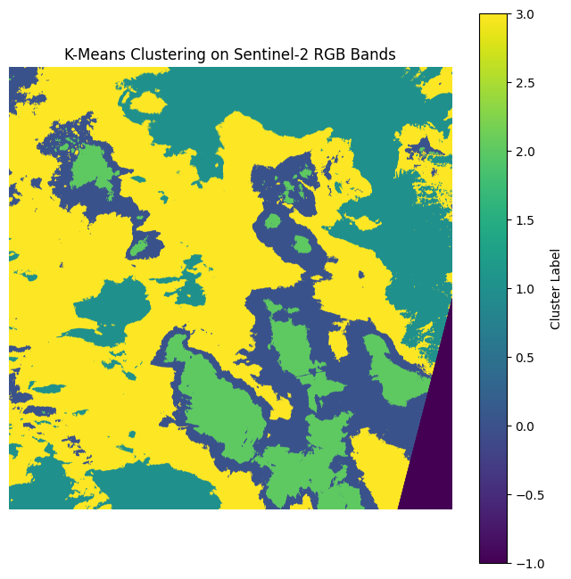
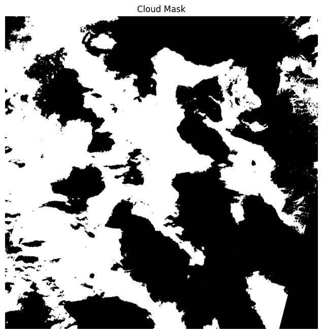
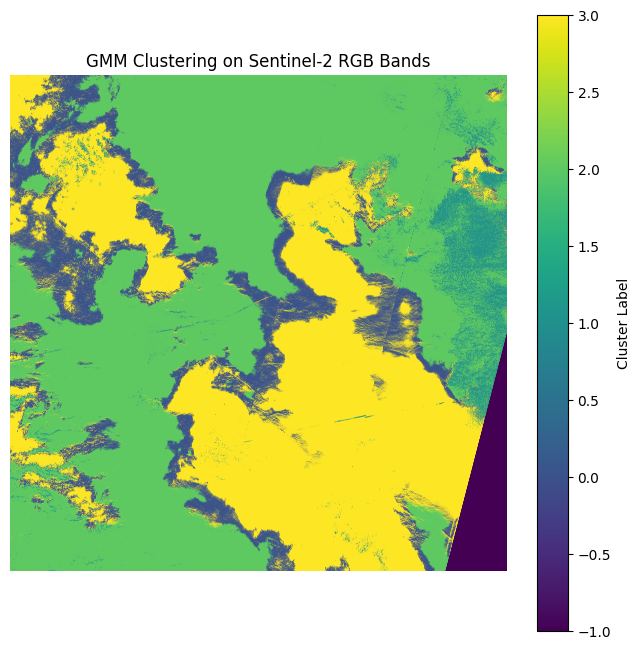
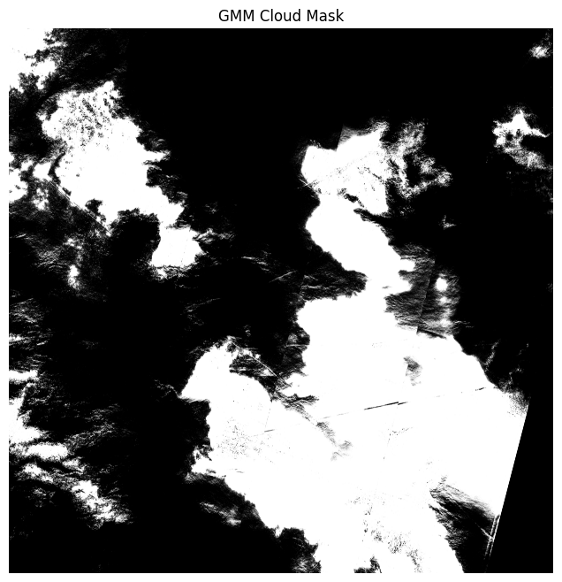

# Cloud-Cover-Classification-AI4EO
# Table of Contents

- [Project Overview](#project-overview)
- [Motivation](#motivation)
- [Study Area](#study-area)
- [Data](#data)
- [Methodology](#methodology)
  - [Method Overview](#method-overview)
  - [K-Means Clustering](#k-means-clustering)
  - [Gaussian Mixture Model (GMM)](#gaussian-mixture-model-gmm)
  - [Cloud Identification](#cloud-identification)
- [Results](#results)
  - [K-Means Clustering Results](#k-means-clustering-results)
  - [Gaussian Mixture Model (GMM) Results](#gaussian-mixture-model-gmm-results)
  - [Quantitative and Visual Comparison](#quantitative-and-visual-comparison)
- [Discussion](#discussion)
- [Limitations](#limitations)
- [Environmental and Computational Considerations](#environmental-and-computational-considerations)
# Project Overview
This project focuses on cloud cover classification using Sentinel-2 satellite imagery. The objective is to identify cloud-covered pixels by analysing spectral information from selected bands and applying a machine learning model.

The workflow includes data preprocessing, feature extraction, model training, and the generation of a cloud mask. The final output is a classification map distinguishing cloud and non-cloud regions.

# Motivation
Optical satellite imagery, such as data from the Sentinel-2 mission, plays a key role in Earth Observation (EO) by providing high-resolution information about the Earth's surface. These data are widely used in applications such as land cover mapping, vegetation monitoring, environmental assessment, and disaster management.

However, one of the main limitations of optical imagery is the presence of clouds. Clouds can partially or completely obscure the surface, leading to missing or unreliable information. As a result, many EO applications require an effective cloud detection step before further analysis can be performed.

Traditional approaches to cloud detection often rely on simple thresholding techniques based on spectral properties. While these methods are computationally efficient, they may struggle in complex scenarios, such as thin clouds or bright surfaces.

Recent advances in artificial intelligence, particularly machine learning and deep learning, have improved cloud detection performance. However, these methods often require large labelled datasets and significant computational resources.

This project is motivated by the need for a balanced approach: developing a method that is both effective and computationally efficient. By using spectral features and a classical machine learning model, this work aims to provide a practical solution that can be applied in real-world EO workflows with lower environmental cost.

# Study Area

The study area is located around London, United Kingdom, and was selected using a geographic bounding box covering longitudes from **-0.35 to 0.15** and latitudes from **51.35 to 51.65**. This bounding box was used to query Sentinel-2 Level-2A imagery from the Copernicus Data Space Ecosystem.

The downloaded Sentinel-2 product corresponds to tile **T30UYC**, which intersects the selected London study area. Since Sentinel-2 products are distributed as full tiles, the downloaded image covers a larger spatial extent than the initial query region.

The selected scene contains extensive cloud coverage with varying cloud thickness and semi-transparent cloud structures. These characteristics make the scene suitable for testing unsupervised machine learning approaches for cloud classification.

The RGB image generated from Sentinel-2 bands B02 (Blue), B03 (Green), and B04 (Red) was used for visual interpretation and as input for both K-Means clustering and Gaussian Mixture Model (GMM) classification workflows.

<p align="center">
  
  
</p>
 
# Data

This project uses Sentinel-2 Level-2A optical satellite imagery obtained from the Copernicus Data Space Ecosystem. The selected product was acquired by Sentinel-2B on **30 June 2022** and corresponds to tile **T30UYC**.

Sentinel-2 Level-2A data were selected because they provide atmospherically corrected surface reflectance, which is suitable for image classification and spectral analysis.

The analysis uses three 10 m resolution optical bands:

| Band | Description | Resolution |
|------|-------------|------------|
| B02 | Blue | 10 m |
| B03 | Green | 10 m |
| B04 | Red | 10 m |

These bands were stacked to create a true-colour RGB image and were also used as input features for the unsupervised clustering methods.

The downloaded Sentinel-2 product was provided in `.SAFE` format. The relevant image files were located in the `IMG_DATA/R10m/` folder as `.jp2` files.

The original RGB image shows extensive cloud coverage across the scene, including dense bright cloud regions, semi-transparent cloud structures, and partially visible surface features beneath the cloud layer. These characteristics make the scene suitable for testing cloud classification methods using multispectral satellite imagery.

<p align="center">
  
</p>

# Methodology

## Method Overview

This project uses unsupervised machine learning methods to classify cloud-covered regions from Sentinel-2 RGB imagery. The overall workflow consists of reading Sentinel-2 optical bands, stacking the RGB bands into a feature matrix, applying clustering algorithms, and extracting the cloud-related cluster as a binary cloud mask.

Two unsupervised clustering methods were applied and compared:

1. **K-Means Clustering**
2. **Gaussian Mixture Model (GMM)**

Both methods used the same input features: Sentinel-2 bands **B02 (Blue)**, **B03 (Green)**, and **B04 (Red)**.


## K-Means Clustering

K-Means clustering is an unsupervised machine learning algorithm that groups pixels based on spectral similarity. In this project, each pixel was represented by its RGB reflectance values:

```text
Pixel = [Red, Green, Blue]
```

The algorithm divides the image pixels into a fixed number of clusters. Pixels with similar RGB values are assigned to the same cluster.

K-Means performs **hard clustering**, meaning each pixel can only belong to one cluster. This makes the method simple, fast, and easy to interpret. However, it can also produce sharp boundaries between clusters, which may be less suitable for gradual cloud transitions or thin cloud areas.

<p align="center">
  
</p>

### K-Means Workflow Summary

| Step | Description |
|---|---|
| Data Input | Sentinel-2 Level-2A RGB bands |
| Preprocessing | Read and stack B02, B03, B04 |
| Feature Matrix | Convert image into RGB pixel vectors |
| Clustering | Apply K-Means clustering |
| Cloud Selection | Select brightest cluster |
| Output | Binary cloud mask |


## Gaussian Mixture Model (GMM)

Gaussian Mixture Model is also an unsupervised clustering method, but it uses a probabilistic approach. Instead of assigning pixels only by distance to a cluster centre, GMM models the pixel values as a mixture of Gaussian distributions.

Each pixel is assigned to the component with the highest probability. This allows GMM to capture more gradual transitions between different surface or cloud types.

Compared with K-Means, GMM is more flexible and can better represent semi-transparent clouds, cloud edges, and subtle spectral variations. However, it is also more computationally expensive.

<p align="center">
  
</p>

### GMM Workflow Summary

| Step | Description |
|---|---|
| Data Input | Sentinel-2 Level-2A RGB bands |
| Preprocessing | Read and stack B02, B03, B04 |
| Feature Matrix | Convert image into RGB pixel vectors |
| Clustering | Apply Gaussian Mixture Model |
| Cloud Selection | Select highest reflectance component |
| Output | Binary cloud mask |


## Cloud Identification

Clouds generally appear bright in true-colour Sentinel-2 imagery because they have high reflectance in the visible bands. After clustering, the cluster corresponding to the brightest cloud-covered regions was selected as the cloud class.

The selected cloud cluster was then converted into a binary cloud mask:

```text
Cloud = 1
Non-cloud = 0
```

In the final cloud mask, white pixels represent cloud-covered regions, while black pixels represent non-cloud regions or background areas.

This cloud identification step was performed separately for both K-Means and GMM outputs, allowing the two methods to be compared visually and quantitatively.

# Results

## K-Means Clustering Results

The K-Means clustering approach successfully separated the Sentinel-2 RGB image into several spectrally distinct clusters based on pixel reflectance values in bands B02 (Blue), B03 (Green), and B04 (Red). The generated classification map shows clear spatial separation between bright cloud-covered regions and darker background surfaces.

<p align="center">
  
</p>

The brightest clusters within the classification result correspond primarily to thick cloud-covered regions. These areas exhibit high reflectance across all visible bands, causing them to appear as dominant bright regions within the clustering map.

After identifying the cloud-related cluster, a binary cloud mask was generated:

<p align="center">
  
</p>

The K-Means cloud mask demonstrates that the method was effective in identifying large-scale dense cloud systems across the scene. Major cloud masses were extracted clearly, especially within the central and southern regions of the image.

Several cloud characteristics can be observed from the result:

- **Dense thick clouds** were successfully identified as continuous bright regions.
- **Large stratiform cloud structures** were captured with relatively smooth spatial boundaries.
- **Cloud-free regions** and darker background surfaces were generally separated successfully.
- **Thin cloud edges** and transitional cloud boundaries were simplified due to the hard clustering behaviour of K-Means.

The resulting cloud mask appears relatively clean and spatially stable, although some smaller cloud textures and semi-transparent cloud structures were not fully preserved.


## Gaussian Mixture Model (GMM) Results

The Gaussian Mixture Model produced a more detailed and probabilistic classification of the Sentinel-2 RGB image. Unlike K-Means, GMM models the spectral distribution of pixels using multiple Gaussian probability distributions, allowing more gradual transitions between clusters.

<p align="center">
  
</p>

The GMM classification map reveals considerably more spatial texture and fine-scale variability compared with the K-Means result. Cloud boundaries appear more complex, and subtle spectral differences within cloud-covered regions are represented more effectively.

The resulting binary cloud mask is shown below:

<p align="center">
  
</p>

The GMM cloud mask preserved more detailed cloud structures across the scene. In particular:

- **Semi-transparent clouds** were more visible compared with the K-Means result.
- **Thin cloud filaments** and cloud edges were captured more effectively.
- **Gradual cloud transitions** were represented more realistically.
- **Small fragmented cloud structures** became more apparent throughout the image.

However, the higher sensitivity of GMM also introduced more fragmented patterns and isolated noisy regions within some parts of the classification map. This is particularly visible around highly textured cloud boundaries and partially illuminated regions.


## Quantitative and Visual Comparison

The visual comparison between K-Means and GMM demonstrates clear differences in the spatial representation of cloud structures.

| Feature | K-Means | Gaussian Mixture Model (GMM) |
|---|---|---|
| Clustering Type | Hard clustering | Probabilistic clustering |
| Cloud Boundaries | Sharp and simplified | Smooth and gradual |
| Thick Cloud Detection | Strong | Strong |
| Thin Cloud Detection | Limited | Improved |
| Semi-transparent Clouds | Less visible | More visible |
| Spatial Detail | Moderate | High |
| Noise Sensitivity | Lower | Higher |
| Computational Complexity | Lower | Higher |
| Visual Smoothness | Cleaner large regions | More fragmented detail |

From the comparison, K-Means produced cleaner and more visually stable cloud masks, particularly for large dense cloud systems. In contrast, GMM preserved significantly more fine-scale cloud detail and was better able to represent gradual spectral transitions between clouds and background surfaces.


# Discussion

The results demonstrate that both unsupervised machine learning methods were capable of identifying major cloud-covered regions within the Sentinel-2 RGB imagery using only visible-band reflectance information.

The K-Means approach performed well for extracting large dense cloud systems and produced visually clear classification results. Because K-Means assigns each pixel exclusively to a single cluster, the resulting cloud masks contained relatively smooth and homogeneous cloud regions. This made the overall cloud structures easier to interpret visually.

However, the hard clustering behaviour also reduced the ability of K-Means to represent subtle spectral transitions. Semi-transparent cloud structures, thin cloud edges, and fragmented cloud textures were often simplified or merged into larger homogeneous regions.

The Gaussian Mixture Model produced more detailed and spatially complex cloud representations. The probabilistic nature of GMM allowed the model to better capture gradual transitions between cloud and non-cloud regions. As a result, thin clouds, cloud edges, and partially transparent cloud layers were represented more effectively.

At the same time, the increased sensitivity of GMM introduced more noise and fragmented patterns into the cloud mask. Some isolated pixels and highly textured cloud structures may represent over-segmentation caused by spectral variability within the scene.

An important characteristic of this study area is that the original Sentinel-2 image contains extensive cloud coverage across most of the scene. Large portions of the image are dominated by thick cloud systems, with only limited visible surface information beneath the cloud layer.

This extensive cloud coverage creates several challenges for unsupervised classification:

- The spectral contrast between cloud and non-cloud regions becomes less distinct in some areas.
- Thin clouds and semi-transparent cloud structures create gradual reflectance transitions.
- Limited cloud-free background regions reduce the spectral diversity available for clustering.
- Some cloud edges contain mixed spectral information, making perfect separation difficult.

As a result, neither K-Means nor GMM was able to produce a completely perfect cloud classification across the entire image. Nevertheless, both methods successfully identified the dominant cloud-covered regions and demonstrated the potential of unsupervised learning approaches for cloud detection in multispectral satellite imagery.

---

# Limitations

Several limitations should be considered in this study.

First, only three visible Sentinel-2 bands (B02, B03, and B04) were used for the classification process. Although RGB imagery provides useful visual information, additional spectral bands such as Near-Infrared (NIR) or Shortwave Infrared (SWIR) could improve cloud discrimination and reduce confusion between clouds and bright surfaces.

Second, the study relied entirely on unsupervised clustering methods without using labelled ground truth data. As a result, cluster interpretation required manual visual identification of cloud-related clusters.

Third, the original Sentinel-2 scene was heavily cloud-covered, which reduced the amount of visible surface information and increased the difficulty of separating cloud and non-cloud regions perfectly.

Finally, both K-Means and GMM are sensitive to parameter selection, including the number of clusters or Gaussian components. Different parameter settings may produce different classification results and cloud masks.

# Environmental and Computational Considerations

This project was implemented using Google Colab and standard Python scientific computing libraries, including NumPy, Rasterio, Scikit-learn, and Matplotlib.

Compared with deep learning approaches for cloud detection, the computational and environmental cost of this project is relatively low. Both K-Means and Gaussian Mixture Model (GMM) are classical machine learning methods that require significantly less computational power than convolutional neural networks or transformer-based remote sensing models.

The analysis was performed using only three Sentinel-2 visible bands (B02, B03, and B04), which reduced both memory usage and processing time. However, Sentinel-2 imagery still contains a large number of pixels at 10 m spatial resolution, meaning that memory management remained important during processing.

During experimentation, memory limitations were encountered within the standard free version of Google Colab, particularly when processing full-resolution multispectral imagery. To reduce RAM usage, the workflow avoided unnecessary intermediate variables and focused only on the required RGB bands instead of the full Sentinel-2 spectral dataset.

From a computational perspective, K-Means clustering was more efficient and faster to execute than the Gaussian Mixture Model. The GMM approach required additional probabilistic calculations and therefore consumed more computational resources and processing time.

Although the environmental impact of this project is relatively small compared with large-scale deep learning workflows, computational efficiency remains important in remote sensing applications because satellite datasets can become extremely large when processed at regional or global scales.

Overall, the use of lightweight unsupervised machine learning methods allowed cloud classification to be performed with relatively low computational cost while still producing meaningful classification results.
